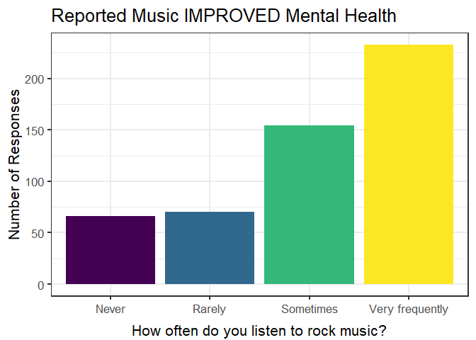

# DATA 334 Final Project


``` r
initial_data <- read_csv("data/mxmh_survey_results.csv")
```

    Rows: 736 Columns: 33
    ── Column specification ────────────────────────────────────────────────────────
    Delimiter: ","
    chr (26): Timestamp, Primary streaming service, While working, Instrumentali...
    dbl  (7): Age, Hours per day, BPM, Anxiety, Depression, Insomnia, OCD

    ℹ Use `spec()` to retrieve the full column specification for this data.
    ℹ Specify the column types or set `show_col_types = FALSE` to quiet this message.

``` r
wrangled_data <- initial_data |> rename(primary_streaming_service = `Primary streaming service`,
               hours_per_day = `Hours per day`,
               while_working = `While working`,
               fav_genre = `Fav genre`,
               foreign_languages = `Foreign languages`,
               music_effects = `Music effects`,
               Classical = `Frequency [Classical]`,
               Country = `Frequency [Country]`,
               EDM = `Frequency [EDM]`,
               Folk = `Frequency [Folk]`,
               Gospel = `Frequency [Gospel]`,
               `Hip Hop` = `Frequency [Hip hop]`,
               Jazz = `Frequency [Jazz]`,
               `K-Pop` = `Frequency [K pop]`,
               Latin = `Frequency [Latin]`,
               Lofi = `Frequency [Lofi]`,
               Metal = `Frequency [Metal]`,
               Pop = `Frequency [Pop]`,
               `R&B` = `Frequency [R&B]`,
               Rap = `Frequency [Rap]`,
               Rock = `Frequency [Rock]`,
               `Video Game` = `Frequency [Video game music]`) |>
  select(-Permissions) |> 
  mutate(music_improve = recode(music_effects, 
                                'Improve'= '1', 
                                'No effect'='0', 
                                'Worsen' = '-1')) |>
  mutate(music_improve = as.numeric(music_improve))
```

# **Music and Mental Health!**

This project aims to explore the frequency that individuals struggling
with anxiety, depression, OCD, or insomnia listen to specific music
genres, and to determine if those who listen believe music had effected
their overall mental health.

## Data

The data used in this project comes from an undergraduate student from
the University of Washington, uploaded to
[Kaggle](https://www.kaggle.com/datasets/catherinerasgaitis/mxmh-survey-results?resource=download).

The online survey obtained responses from 736 people, gathering
information about whether music has improved or worsened the state of
individuals’ mental health. Within the survey, people were asked to rate
how much they listen to 16 different music genres and were also
presented with symptoms of Anxiety, Depression, OCD, and Insomnia and
asked to rank each disorder on a scale of 0 to 10; 0 representing not
having experienced this disorder at all and 10 representing having
experienced this disorder regularly or to an extreme.

## Results

A Shiny App was created to aid in the exploration of responses, allowing
users to choose genre, disorder, minimum number of symptoms reported,
and the overall effect music has had on metal health. The app produces a
number of plots similar to the one below. This plot contains the
reported frequency of listening to **rock** music of those who have
experienced **anxiety** symptoms and say music has **improved** their
mental health.



Overall findings suggest people frequently listening to rock music
report it improving their mental health, regardless of reported
symptoms. Further exploration of the Shiny App also reveals more
individuals who listen to video game music frequently *and* have
experienced depression report music worsening their mental health.

It is important to note that these conclusions are drawn from
self-reported data, which is prone to be effected by personal biases and
uncontrollable outside variables.
